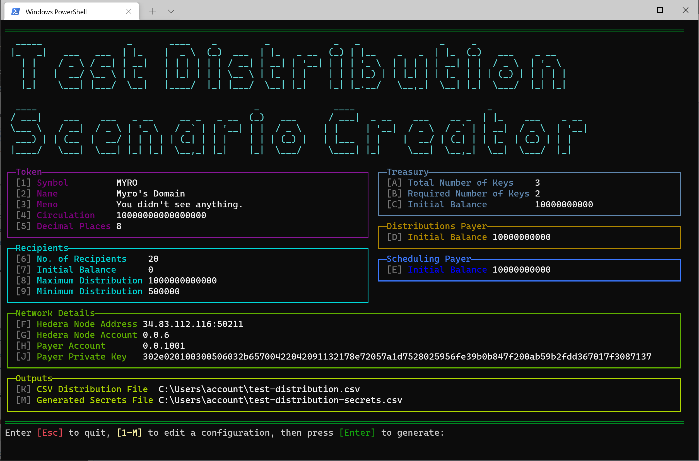

## Title

Hedera Test Scenario Creator

## Description

This is a developer tool utilized to create various test scenarios for the [Hedera](https://hedera.com) network. Initially, it was developed to boostrap the [HTS-distribution-tool](https://github.com/the-creators-galaxy) it is able to automatically generate `.csv` records that contain Hedera account details, such as their Account ID, public key, and private keys. 

For those building on the Hedera network, we hope it's helpful!

### Disclaimer

> This is alpha software. It has not been audited. *Use at your own risk.*

> Hedera plz don't yell at us for helping people create a lot of accounts lol

## Technologies

- [.NET](https://dotnet.microsoft.com/)  (v. 5.0 or later)
- [C#](https://docs.microsoft.com/en-us/dotnet/csharp/)
- [Hedera's .NET SDK](https://github.com/bugbytesinc/Hashgraph)

## Getting started

#### Installation

1. `git clone https://github.com/the-creators-galaxy/hedera-test-scenario-creator.git`
2. `cd hedera-test-scenario-creator`
3. `dotnet restore`

#### Running the project

`dotnet run`

#### Runtime disclaimer  

**Please note**: due to the Hedera network throttling settings, this tool can take a long time to complete if the user chooses to create a large number of recipient accounts. This is not the fault of the tool, it is a limitation of the Hedera Network settings, given it's a public utility. 

> Please use with caution and respect for others attempting to use the network. 

## Deployment

#### Staging

There is no staging environment for this project, as it's intended to be run locally.

#### Production

There is no production environment for this project, as it's intended to be run locally.

## How it works

#### Overview 

This tool helps developers create token distribution scenarios by creating a new collection of tokens, administrative accounts, and one or more pre-associated accounts for receiving token distributions on the [Hedera network](https://hedera.com) of your choice. The scenario can be adjusted in various ways including the number of keys required to send funds from the treasury.  The entire set of accounts created by this tool are stand-alone and do not rely on any other external account or key, thus are immutable.

_(Payer account and Private key defaults will not work on a public network)_

#### Output 

The tool generates two output files:  The first one, the "distribution CSV", contains a list of accounts that should receive tokens during a distribution, and a randomly generated amount of token to receive.  It creates this file in a format that is designed to be directly consumed by the [hts-distribution-tool](https://github.com/the-creators-galaxy/hts-distribution-tool). The second, "secrets file", contains an inventory of the token information and accounts created for this scenario, including the public and private keys for each account. This file contains the secrets that must be manually entered in the hts-distribution-tool, including private keys that can be used to "unlock" the "treasury account" to send tokens.

## Authors

[Jason Fabritz](mailto:jason@calaxy.com)

## License

[MIT](/LICENSE)